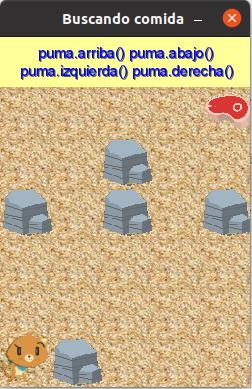

# El Puma hambriento

**Objetos y mensajes (Con Wollok Game)**

### Nivel 1

Enviar mensajes desde la consola para lograr que el puma logre alcanzar al churrasco.

Comenzar a jugar con:

```
pantalla.iniciar()
```

Los mensajes que entiende el puma son:

```
arriba()
abajo()
izquierda()
derecha()
```

*¡Ojo! No se puede pasar por las piedras*



